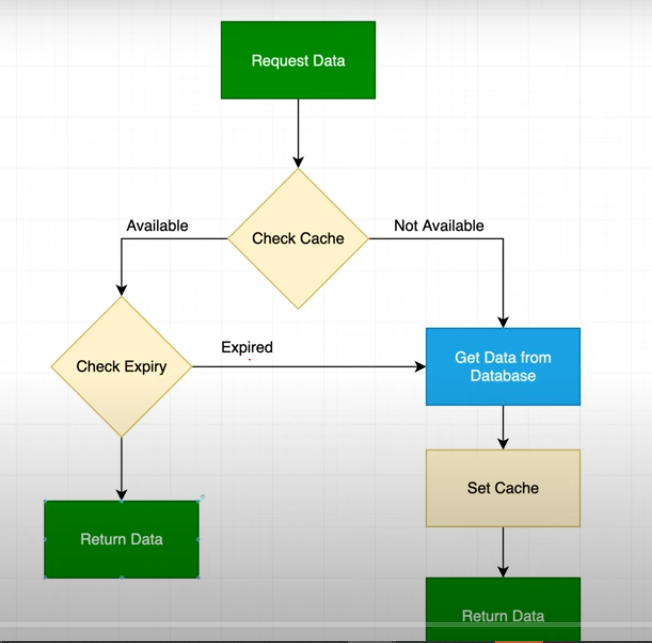
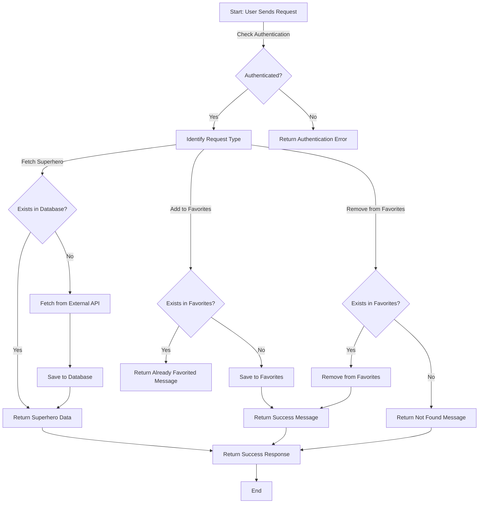

# Superhero API


## Table of Contents
1. [Introduction](#introduction)
   - [Overview](#overview)
   - [Project Overview](#project-overview)
2. [Architecture](#architecture)
   - [Components](#components)
   - [Caching Strategy](#caching-strategy)
3. [Database](#database)
   - [Schema](#schema)
   - [Data Models](#data-models)
4. [API Guide](#api-guide)
   - [Request Flow](#request-flow)
   - [API Overview](#api-overview)
   - - [Flowchart](#flowchart)
   - [Auth Details](#auth-details)
   - [Super Hero Details](#super-hero-details)
   - [Favorite List Details](#favorite-list-details)
   - [Response Messages](#response-messages)
   - [Usage Examples](#usage-examples)
5. [Integration Services](#integration-services)
   - [External Services](#external-services)
6. [Setup and Configuration](#setup-and-configuration)
7. [Getting Started](#getting-started)
   - [Development Environment](#development-environment)
   - [Dependencies](#dependencies)

---

## Introduction

### Overview
The **Superhero API** is a powerful RESTful service that provides access to superhero data, including authentication, favorites, and external API integrations.

### Project Overview
The project follows a clean architecture pattern, ensuring modularity, scalability, and ease of maintenance.

---

## Architecture

### Components
The system follows the **Repository Pattern** for managing data access and separation of concerns.


### Caching Strategy
To improve performance and reduce database load, we have implemented a **cache-first strategy**.

#### **How It Works:**
1. When a request is made, the system first **checks the cache**.
2. If data is **available and valid**, it is returned from the cache.
3. If data is **expired** or **not found**, the system retrieves it from the database.
4. Once retrieved, data is **stored in the cache** for future requests.

#### **Flowchart**
The following diagram illustrates the caching process:



---

## Database

### Schema
The database structure follows a relational model with user authentication, superhero details, and favorite superheroes.


### Data Models
- **Users**: Manages authentication and authorization.
- **Superheroes**: Stores superhero-related details.
- **FavoriteSuperheroes**: Stores user-favorite superheroes.

---

## API Guide

### Request Flow
The API follows a structured flow from **request to response** with authentication and validation layers.

### API Overview
Here is a list of the available API endpoints:
### Flowchart

This flowchart illustrates the API request flow, including authentication, database checks, and external API interactions.




### Auth Details
- `POST /api/Account/register` - Registers a new user.
- `POST /api/Account/login` - Authenticates an existing user.

### Super Hero Details
- `GET /api/Superhero/{id}` - Retrieves superhero details by ID.
- `GET /api/Superhero/name/{name}` - Retrieves superhero details by name.

### Favorite List Details
- `GET /api/SuperheroFromExternalAPI/favorites` - Retrieves a user's favorite superheroes.
- `POST /api/SuperheroFromExternalAPI/favorites` - Adds a superhero to the user's favorite list.

### Response Messages
All API responses follow a consistent format:
```json
{
  "status": "success",
  "message": "Data retrieved successfully",
  "data": { }
}
```

## Usage Examples

### **Register a New User**

**Request:**

```http
POST /api/Account/register
Content-Type: application/json
```

**Body:**

```json
{
  "username": "john_doe",
  "email": "johndoe@example.com",
  "password": "SecurePass123!"
}
```

**Response (Success 200 OK):**

```json
{
  "message": "User registered successfully",
  "userId": "12345"
}
```

**Response (Failure 400 Bad Request):**

```json
{
  "error": "Email is already in use"
}
```

### **Get Superhero by ID**

**Request:**

```http
GET /api/Superhero/1
```

**Response (Success 200 OK):**

```json
{
  "id": 1,
  "name": "Spider-Man",
  "powerstats": {
    "intelligence": 90,
    "strength": 55
  },
  "biography": {
    "fullName": "Peter Parker"
  }
}
```

### **Add a Superhero to Favorites**

**Request:**

```http
POST /api/Favorites/add
Content-Type: application/json
Authorization: Bearer <token>
```

**Body:**

```json
{
  "userId": "12345",
  "superheroId": 1
}
```

**Response (Success 201 Created):**

```json
{
  "message": "Superhero added to favorites successfully"
}
```


---

## Integration Services

### External Services
This API integrates with external superhero data sources to fetch and store relevant information
for details [Superheroapi](https://superheroapi.com/).


---

## Setup and Configuration
Ensure that you have the following installed:
- .NET Core
- SQL Server
- Entity Framework Core

### Getting Started

#### Development Environment
1. Clone the repository:
   ```sh
   git clone https://github.com/MohamedElgeddawy/superhero-api.git
   ```
2. Navigate to the project directory:
   ```sh
   cd superhero-api
   ```
3. Install dependencies:
   ```sh
   dotnet restore
   ```

#### Dependencies
- ASP.NET Core Web API
- Entity Framework Core
- JWT Authentication

